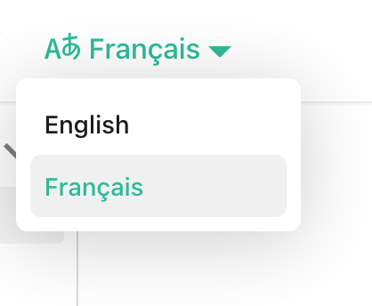

# Markdown Crash Course

This readme has been modified, but its source comes from the following video course.

[](https://youtu.be/ftOBvusMHjQ)

**Tip:**  You can quickly add most of these markdown elements by clicking Ctl + Space, and then pressing the up keyboard arrow to view many available markdown options. Also, if you have the learn-markdown extension installed, you can find them in the VS Code command palette, or when you have the legacy view enabled, you click the icons available on the status bar.

---

## Basic Syntax

### Headings

Below are 6 heading variations.

# Heading 1

## Heading 2

### Heading 3

#### Heading 4

##### Heading 5

###### Heading 6

---

### Horizontal Rule

3 dashes creates a horizontal line.

---

### Text formating

Paragraph line spacing is important.
This sentence is on the same line even though it's on the next line of the editor because there's no separation of content.

Add an empty line between elements.

*italic text* and *more italic text*

**bold text** and **more bold text**

***bold and italic text***

**mix *and* match**

~~strikethrough text~~

### Lists

Ordered List

1. Item 1
2. Item 2
3. Item 3

Unordered List

- Item
- Item
- Item

Complex lists. Use tabs to set up substeps.

1. Item 1
   1. Something
   2. Something else
1. Item 2
   - Something more.
   - And still more.
1. Item 3
    Results line.

1. Then another step.

### Code formating

Inline: Use JavaScript `map()` on arrays.

Fenced code block:

```js
const sum = (a, b) => a + b

sum(2,2)
```

### Blockquote

> This is a blockquote
>
> more text
>
> > Nexted blockquote

### Links

[codeSTACKr](https://youtube.com/codeSTACKr 'codeSTACKr YouTube')

[Headings](#headings)

[codeSTACKr][cs]

[cs]: https://youtube.com/codeSTACKr 'codeSTACKr YouTube'

### Images

Relative link to image:



Absolute link to image:


## Extended Syntax

Not all extended syntax features work in all markdown applications.

### Table

To add a table, you can use three or more hyphens (---) to create each column’s header, and use pipes (|) to separate each column. To left-align a column, put a colon to the left of the dashes :--. To right-align, put a colon to the right of the dashes --:. To center-align, surround a dash with two colons :-:.

| Packages |     Description      | Version |
| :------- | :------------------: | ------: |
| React    | JavaScript Framework |   v18.0 |
| Next.js  |   React Framework    |   v12.0 |

However, creating tables manually is tedious. If you have the learn-markdown extension, you can click the Insert Table link to help you. Copy tables from a website and paste them in through Markdown Paste. Or use web site tools like [Tables Generator](https://www.tablesgenerator.com/markdown_tables).

### Task List

- [x] Task 1
- [ ] Task 2
- [ ] Task 3

### Emojis

Emoji's are fun! These are probably ok to use in our blog pages. :joy:

For a list of available emojis, see [https://gist.github.com/rxaviers/7360908](https://gist.github.com/rxaviers/7360908)

### Toggle

<details>
  <summary>This is a toggle!</summary>

  Contents of toggle.
</details>

### Callouts

> :bulb: **Tip:** Here's an important tip to remember!

## Docusaurus admonitions

These won't show in the VS Code preview, but here's what to copy.

Or copy pieces from [Docusaurus help](https://docusaurus.io/docs/next/markdown-features/admonitions).

:::note

Some **content** with *Markdown* `syntax`. Check [this `api`](#).

:::

:::tip

Some **content** with *Markdown* `syntax`. Check [this `api`](#).

:::

:::info

Some **content** with *Markdown* `syntax`. Check [this `api`](#).

:::

:::caution

Some **content** with *Markdown* `syntax`. Check [this `api`](#).

:::

:::danger

Some **content** with *Markdown* `syntax`. Check [this `api`](#).

:::
